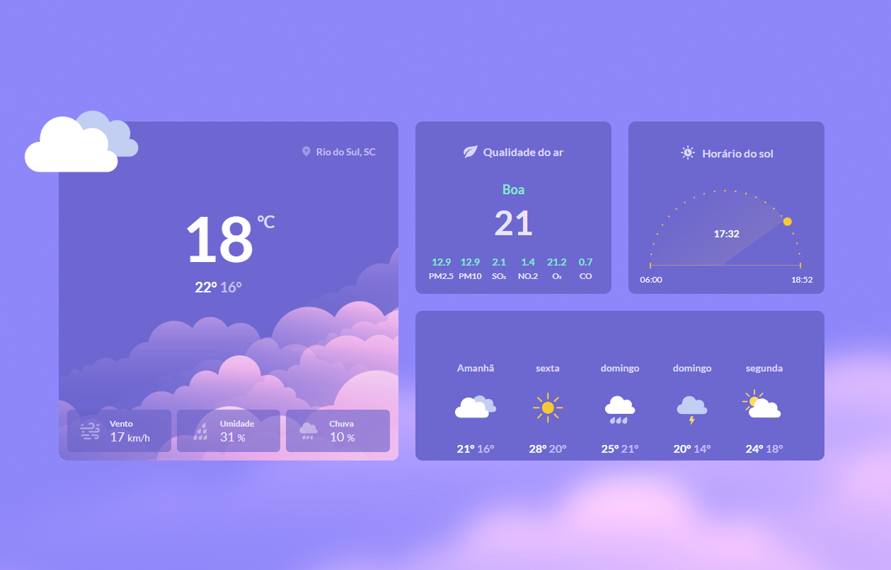
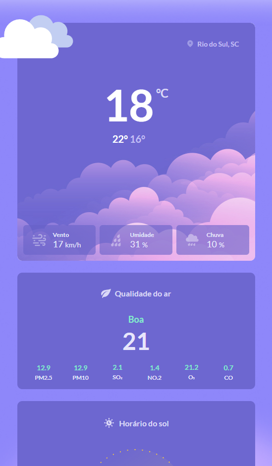

# Tela de clima responsiva  
Este projeto é uma tela de clima criado usando HTML e CSS. E uma tela completa aonde mostra todas as informações necessária, e tudo isso sendo responsiva .

## Pré-requisitos

- Navegador web moderno (Chrome, Firefox, Safari, etc.)
- Editor de código (opcional, para editar o código-fonte)

## Instalação

1. Clone este repositório para sua máquina local usando o comando:
   ```bash
   git clone https://github.com/FabioCoutinho1/clima
2. Navegue para o diretório do projeto:
    ```bash
    cd clima
3. Abra o arquivo index.html em um navegador de sua escolha.

## Uso

Após abrir o arquivo `index.html` em um navegador, você verá o cartão de embarque exibido com os estilos definidos em `styles.css`. Você pode personalizar o conteúdo editando o arquivo `index.html` e ajustar o estilo no arquivo `styles.css`.

## Exemplos

### Tela para Descktop


### Tela para Mobili


# [Va para o site](https://fabiocoutinho1.github.io/clima/)

## Contribuição

Se você gostaria de contribuir para este projeto, siga estes passos:

1. Faça um fork deste repositório.
2. Crie uma nova branch (`git checkout -b feature/nova-funcionalidade`).
3. Faça as suas alterações e commit (`git commit -am 'Adiciona nova funcionalidade'`).
4. Envie a branch para o repositório (`git push origin feature/nova-funcionalidade`).
5. Crie um pull request.

Por favor, siga o [Guia de Contribuição](docs/CONTRIBUTING.md) para mais detalhes.

## Licença

Este projeto está licenciado sob a Licença MIT - veja o arquivo [LICENSE](LICENSE) para detalhes.

## Contato

Se você tiver alguma dúvida ou feedback, sinta-se à vontade para entrar em contato comigo:

- Nome: Fabio Coutinho
- Email: fabiofarias549@gmail.com